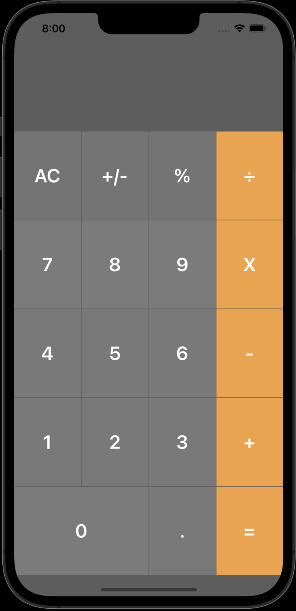
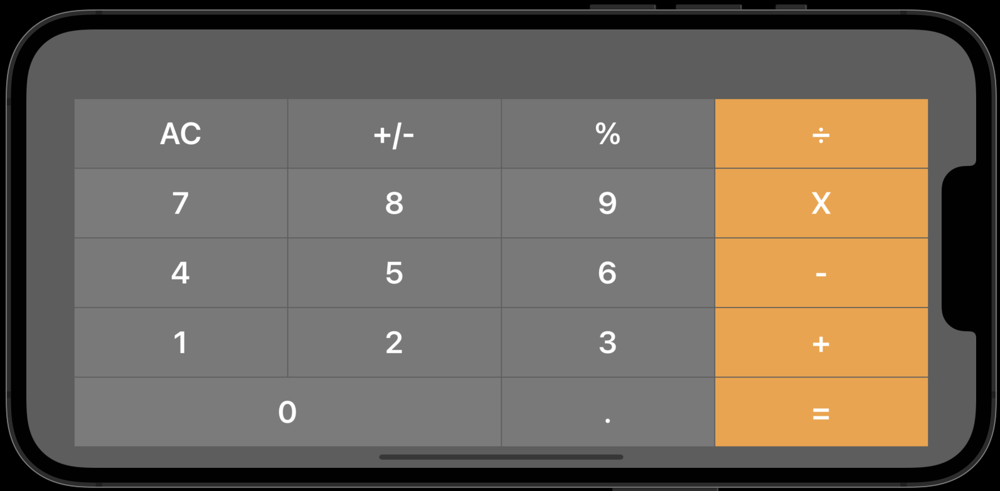
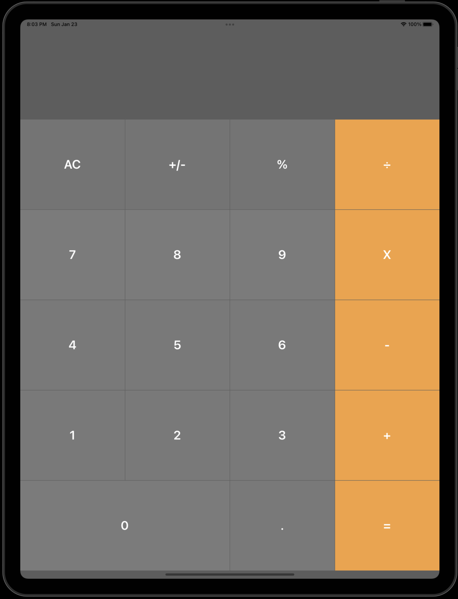
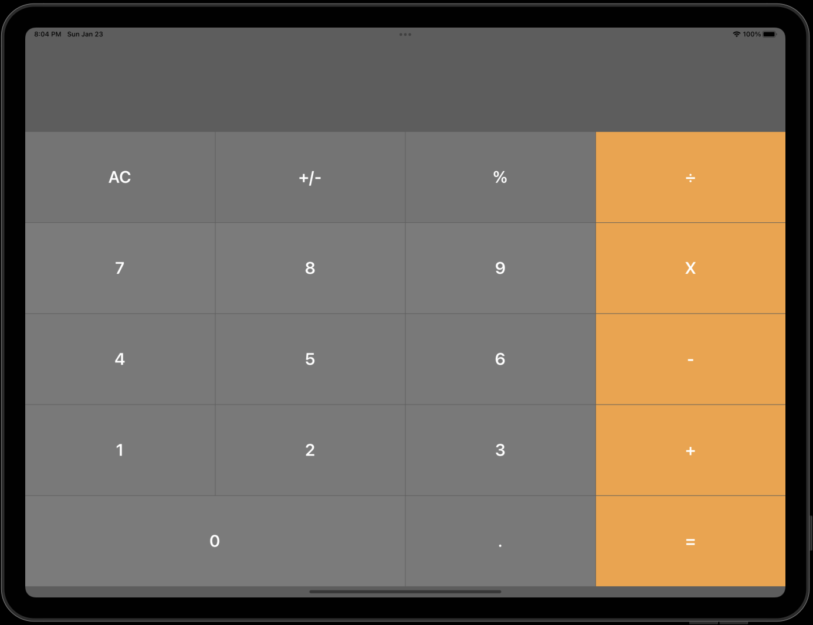

# Calculator In Swift

A simple Calculator app which includes following operations / features.

## Features
- Addition (+)
- Subtraction  (-)
- Multiplication (x)
- Division (÷)
- Percentage (%)

## What we learn in this application
- Use of Stack View UI. 
- Use of Switch statement.
- Use of Double datatype.
- Division operation is not supported by Double in Swft, so we used ```truncatingRemainder(dividingBy: Double)``` function to calculate devision.
- How to check a number is positive or negative.
- How to remove the decimal if the decimal is equal to 0. For example 22.0 to 22. 
- How to convert a number from positive to negative and vice versa, in this applicaton we used ```abs()``` function.
- How to use ```extension```.

## Build On
- XCode 13.2
- Swift 5.5


## Screenshots

### iPhone Portrait Mode


### iPhone Lanscape Mode


### iPad Portrait Mode


### iPad Lanscape Mode



## Contact
**Name:** Manish Ahire

**Portfolio:** [www.manishahire.com](https://www.manishahire.com/) 

**Blog:** [www.mobodevstuff.com](https://www.mobodevstuff.com/) 
